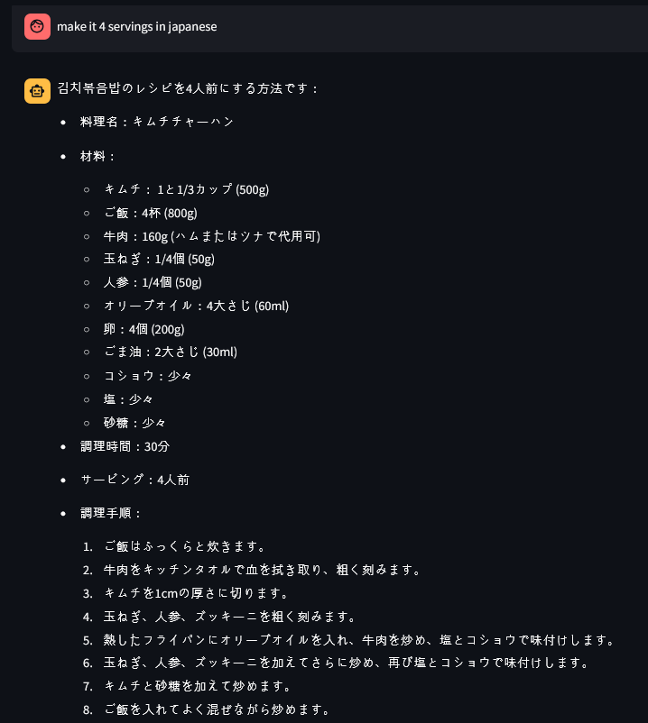

#프로젝트 이름

##📖 목차
- [프로젝트 이름](#프로젝트-이름)
  - [📖 목차](#-목차)
  - [👨‍🏫 프로젝트 소개](#-프로젝트-소개)
  - [팀소개](#팀소개)
  - [프로젝트 계기](#프로젝트-계기)
  - [💜 주요기능](#-주요기능)
  - [📚️ 기술스택](#️-기술스택)
    - [✔️ Language](#️-language)
    - [✔️ Version Control](#️-version-control)
    - [✔️ IDE](#️-ide)
    - [✔️ Framework](#️-framework)
    - [✔️ Deploy](#️-deploy)
    - [✔️  DBMS](#️--dbms)
  - [와이어프레임](#와이어프레임)
  - [프로젝트 파일 구조](#프로젝트-파일-구조)
  - [Trouble Shooting](#trouble-shooting)
    
**##👨‍🏫 프로젝트 소개**


**“고물가 시대…사먹는 것보다 직접 해 먹는 것이 저렴하다!!”**

라면을 끓여도 한강라면을 만드는 당신을 위해 준비했습니다. 

재료! 무게! 조리법! 조리시간! 심지어 칼로리까지?! 챙겨드리는 **요리도움이!!**

**##팀소개**

| 이승열 | 정용선 | 차아인 | 고준원 |
| --- | --- | --- | --- |
| 팀장  | 팀원 | 팀원 | 팀원 |
| [@K-MarkLee](https://github.com/K-MarkLee) | [@Dawol2205](https://github.com/Dawol2205) | [@nyum76](https://github.com/nyum76) |  |

####[저녁에정하기 팀노션 바로가기]([https://www.notion.so/teamsparta/1382dc3ef51480cdac89ec9f05922119](https://www.notion.so/1382dc3ef51480cdac89ec9f05922119?pvs=21))

####[SA Document 바로가기]([https://www.notion.so/teamsparta/SA-Document-1432dc3ef51480b297cdea1f5da815e8](https://www.notion.so/SA-Document-1432dc3ef51480b297cdea1f5da815e8?pvs=21))


----
  
  
**##프로젝트 계기(YS)**

최근 화제 였던 흑백요리사의 끝물을 이어 받아 고물가 시대에 도래한 지금..조금이라도 엄마도 알려주지 않는 요리법을 누구나 할 수 있는 컨셉으로 기획 하게 되었습니다. 누구나 계란후라이 정도는 할 수 있지만 계란후라이에서 끝나는 사람도 있고 라면을 끓여도 한강 라면을 만드는 사람이 있습니다. 그런 분들 특징이 레시피에서 알려주는 한국식 계량법에 문제가 있다고 판단하여 정확한 계량을 알려주는 chatbot형태의 AI를 제작 하였습니다.

---
  
  
**##💜 주요기능**

- 기능 1
    - 유저의 인풋을 받아서 기능 A / B 분할하기
        - 프롬프트를 통해서 a 또는 b 기능으로 프롬프트 나누기.
        
- 기능 2
    - 유저가 음식명을 넣게 되면 그에 해당하는 레시피를 보여준다.
        - 용량을 변경 시킬 수 있다.
        - 4인분  > 1인분 / 4인분  > 10인분
        - 
        
        
        
        
        
- 기능 3
    - 유저가 재료를 넣고 음식을 추천해 달라고 하면, 그 재료를 사용하는 음식들의 리스트를 보여준다.
        - 칼로리 낮은 순서대로 알려줘 / 조리시간이 짧은 순서대로 알려줘
        - 
        
        
        
        
        
- 기능 4 / 5
    - 답변을 음성으로 말해주는 기능.
    - 만약 없는 레시피라면 정중하게 안내하는 기능.
    
    
    

- 기능 6
    - 출력을 다른 언어로 변환이 가능 하게 하는 기능.
    - 
    
    
    
    
    
---
  
    
**##📚️ 기술스택**
  
  
##📚️ 기술스택
<div align=center> 
  
  
  <br>
  
  <br>
  
  <br>
</div>
  
###✔️ 협업 툴
<div align=center>   
  
  
  
  
</div>
  
###✔️ Language
<div align=center>
   
</div>
  
###✔️ Version Control
<div align=center> 
  
</div>
  
###✔️ IDE
<div align=center> 
  
</div>
  
###✔️ Framework
<div align=center> 
  
</div>
  
###✔️ Deploy
<div align=center> 
  
</div>

</div>


##와이어프레임


```
## 프로젝트 파일 구조
├─.devcontainer
├─.github
├─food_db
├─Food_recipe
├─log
├─personal_work
│  ├─고준원
│  ├─이승열
│  │  ├─food_db
│  │  ├─food_recipe
│  │  ├─log
│  │  ├─Prompts
│  │  └─__pycache__
│  ├─정용선
│  └─차아인
└─Prompts
```

##Trouble Shooting
1. 에러 1번
    1. 데이터 크롤링 과정에서 find all next 로 설정하니 그 이후의 모든 텍스트를 가져옴
    2. 해결 > for 문안에 find all next 를 넣고 조건에 맞는다면 break를 설정.
    3. 해결 > 만약 다음 <p>까지의 데이터라면 tag == “p”: break 와 같은 형식.
2. 에러 2번
    1. 데이터를 추출 하는 과정에서 같은줄 알았던 포맷의 변경으로 인한 데이터의 문제
    2. 해결 > 포맷에 맞지 않는 데이터 전처리하고, 빈 데이터는 제거하여 사용함.
3. 에러 3번
    1. 깃 허브 브랜치 연동 이슈
    2. 불가 > 이유불가의 오류로 인한 브랜치 고장이슈. 새로운 리포지토리 생성
4. 에러 4번
    1. append했는데도 데이터가 추가되지 않는 이슈
    2. 해결 > json을 doc으로 변환하는 과정에서 json.dump를 사용하게 됬을때, 데이터를 못 받아드림을 확인. json.dump를 str로 변경후 문제 해결
5. 에러 5번
    1. 데이터를 크롤링 하는 과정에서 용량에 ‘,’ 가 들어가면 데이터가 삭제되는 이슈.
    2. 이유 > ‘,’ 를 기준으로 split되고 있었음을 확인.
    3. 해결 > ‘,’ 앞뒤로 숫자가 있다면 제거하지 않는 패턴을 생성하여 추가하였음.
6. 에러 6번
    1. 이전의 입력값이 뒤의 입력값에 영향을 주지 못하는 이슈
    2. 해결 > deque로 이전의 기록을 append하여 다시 입력
7. 에러 7번
    1. json 파일의 병합의 문제
        1. 파일을 합치면 구조가 변경되어 코드의 재 작성필요함
        2. 데이터만 리스트로 불러와도 구조가 변경되어 코드의 재작성이 필요함
        3. 새로 코드를 불러오니 권한이 없다는 오류가 반환
    2. 해결 > 처음 크롤링 시 분할을 하지 않고 한번에 불러오기
    3. 추가해결점 > 각각의 json을 따로 불러서 vector db 에 병합
8. 에러 8번 
    1. llm의 response 프린트시 구조가 꺠짐을 발견?
    2. 해결 > response.content로 내용만 추출하게함
9. 에러 9번 
    1. 이전의 입력값이 너무 강해 새로운 입력값을 받아들이지 못하는 이슈
    2. 해결 > 채팅창 초기화 버튼을 생성하여 이전의 입력값  삭제
    3. 추가 해결점 > 프롬프트 또는 기타 등등 마지막의 문장에 처리를 하는것이 좋지 않을가 하는 생각
10. 에러 10번
    1. 프롬프트 나누기
    2. 해결 > 큰 차이가 없는 관계로 프롬프트를 나눠서 각가의 프롬프트를 불러오기보다, 프롬프트를 분리하여 순서대로 하나로 합치는것으로 함
11. 에러 13번
    1. 기존의 log파일에 append함수를 사용했는데 새로운  log파일을 생성함
    2. 이유 > 로그파일의 구분을 이름으로 햇는데 이를 timestmap 때문에 계속 갱신이 되었음
    3. 해결 > timestamp로 초까지 나오던 시간을 시간단위로 변경


---
  

1. 문제1
    1. 에러 :  `AttributeError: module 'openai' has no attribute 'OpenAI’` 
    2. 해결 :  `pip install —upgrade openai`
        1. openai 패키지의 버전이 맞지 않아 발생
        2. 터미널에서 openai 패키지를 위 명령어로 업그레이드
2. 문제2 
    1. 문제 : 데이터에 없는 음식을 추천하는 문제
    2. 
    3. 프롬프트에 데이터에 포함되어 있지 않은 음식을 추천하지 않는 지침을 추가하고
    예시 상황을 주어 해결